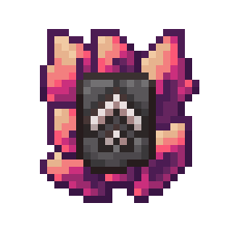
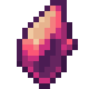
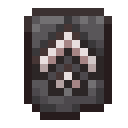

<div align="center">
<h1><br>Power Upgrade</h1>
Addon for Dungeon Difficulty
</div>

# Features

- Allows applying a power scaling to equipment via the smithing table
- Adds power shards
- Adds a Power Upgrade Smithing Template
- Dungeon Difficulty's rules affect Power Upgrade's loot
- Power Upgrade is configurable via datapack and its configuration file

# Mod items
The mod adds these various items obtainable through combat and exploration

|                                Item                                 | Name                       |
|:-------------------------------------------------------------------:|----------------------------|
|                | Small Power Shard          |
|               | Medium Power Shard         |
|                  | Big Power Shard            |
|                 | Huge Power Shard           |
|          | Magnificent Power Shard    |
|  | Power Upgrade Smithing Template |

# Loot rates

Rates below are the drop chance per roll. Difficulty level and type come from [DungeonDifficulty](https://modrinth.com/mod/dungeon-difficulty).

Rates can be modified via datapack.

### Chests

|  Difficulty Level  |  |  |  |  |  |  |
|:------------------:|:---:|:---:|:---:|:---:|:---:|:-------------------------------------------------------------------:|
|    Adventure 1     | 2.5% | - | - | - | - |                                 1%                                  |
|    Adventure 2     | 5% | 2.5% | - | - | - |                                2.5%                                 |
|    Adventure 3     | - | 5% | 2.5% | - | - |                                 5%                                  |
|    Adventure 4     | - | - | 5% | 2.5% | - |                                7.5%                                 |
|    Adventure 5     | - | - | - | 5% | 2.5% |                                 10%                                 |
| Dungeon / Heroic 1 | 5% | - | - | - | - |                                 2%                                  |
| Dungeon / Heroic 2 | 10% | 5% | - | - | - |                                 5%                                  |
| Dungeon / Heroic 3 | - | 10% | 5% | - | - |                                 10%                                 |
| Dungeon / Heroic 4 | - | - | 10% | 5% | - |                                 15%                                 |
| Dungeon / Heroic 5 | - | - | - | 10% | 5% |                                 20%                                 |

### Vaults

|  Difficulty Level  |  |  |  |  |  |  |
|:------------------:|:-----------------------------------------------------:|:---:|:---:|:---:|:---:|:---:|
| Dungeon / Heroic 1 |                         2.5%                          | - | - | - | - | 1% |
| Dungeon / Heroic 2 |                          5%                           | 2.5% | - | - | - | 2.5% |
| Dungeon / Heroic 3 |                           -                           | 5% | 2.5% | - | - | 5% |
| Dungeon / Heroic 4 |                           -                           | - | 5% | 2.5% | - | 7.5% |
| Dungeon / Heroic 5 |                           -                           | - | - | 5% | 2.5% | 10% |

### Ominous Vaults

| Difficulty Level   |  |  |  |  |  |  |
|:------------------:|:---:|:---:|:---:|:---:|:---:|:-----------------:|
| Dungeon / Heroic 1 | 5% | - | - | - | - |        2%         |
| Dungeon / Heroic 2 | 10% | 5% | - | - | - |        5%         |
| Dungeon / Heroic 3 | - | 10% | 5% | - | - |        10%        |
| Dungeon / Heroic 4 | - | - | 10% | 5% | - |        15%        |
| Dungeon / Heroic 5 | - | - | - | 10% | 5% |        20%        |

### Mob Kills

_Base chance (+ base per looting level). The Smithing Template does not currently drop from mob kills._

_*Per looting level_

|  Difficulty Level  |         |  |  |  |  |
|:------------------:|:------------------------------------------------------------:|:---:|:---:|:---:|:---:|
|    Adventure 1     |                        0.5% (+0.25%)                         | - | - | - | - |
|    Adventure 2     |                          1% (+0.5%)                          | 0.5% (+0.25%) | - | - | - |
|    Adventure 3     |                              -                               | 1% (+0.5%) | 0.5% (+0.25%) | - | - |
|    Adventure 4     |                              -                               | - | 1% (+0.5%) | 0.5% (+0.25%) | - |
|    Adventure 5     |                              -                               | - | - | 1% (+0.5%) | 0.5% (+0.25%) |
| Dungeon / Heroic 1 |                          1% (+0.5%)                          | - | - | - | - |
| Dungeon / Heroic 2 |                           2% (+1%)                           | 1% (+0.5%) | - | - | - |
| Dungeon / Heroic 3 |                              -                               | 2% (+1%) | 1% (+0.5%) | - | - |
| Dungeon / Heroic 4 |                              -                               | - | 2% (+1%) | 1% (+0.5%) | - |
| Dungeon / Heroic 5 |                              -                               | - | - | 2% (+1%) | 1% (+0.5%) |


# Configuration

The mod is configured using the `config\power_upgrade\power_upgrade.json` file
```json
{
    "power_upgrade": {
        "enabled": true,
        "can_upgrade_scaled_items": false,
        "can_upgrade_non_scaled_items": true,
        "max_power_level": 5
    }
}
```

> **enabled** (true/false): allows the use of power upgrades in the smithing table

> **can_upgrade_scaled_items** (true/false): allows upgrading items that are already scaled

> **can_upgrade_non_scaled_items** (true/false): allows upgrading non-scaled items

> **max_power_level** (default 5): maximum power level of a scaled item 